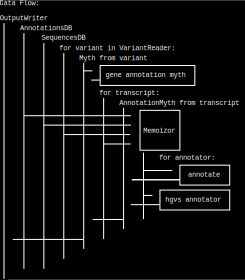

# How variant_myth work

`variant_myth` was created with the aim of being as simple as possible for the user: no database to build or download, just files in known bioinformatics formats.

## Annotators choices

In `variant_myth` command line you could select which annotator are run:
- gene: only output gene transcript id overlap by variant
- feature: variant are flag if they overlap genomic feature, utr, upstream, etc
- effect: variant are flag with effect of variant on rna/protein sequence
- hgvs: add hgvs nomenclature description of variant

## Input

All input could be compressed in gzip, bgzip, bzip2, xz, zstd or not.

### Genome annotation

For genome annotation only [gff3 format](http://www.ensembl.org/info/website/upload/gff3.html) are accepted.

Score column are read but not used.

Only attributes `ID`, `Parent` and `Name` are read and used, other attribute are ignored.

### Genome sequence

Genome sequence in fasta sequence are accepted

### Variant

Vcf header are ignore, only `#CHROM`, `POS`, `REF` and `ALT` column are read, info and genotype information are ignore.

### Translate table

We didn't found translate table format, so inspired by [this ncbi page](https://www.ncbi.nlm.nih.gov/Taxonomy/Utils/wprintgc.cgi) we use a format like this:
```
    AAs  = FFLLSSSSYY**CC*WLLLLPPPPHHQQRRRRIIIMTTTTNNKKSSRRVVVVAAAADDEEGGGG
  Starts = ---M------**--*----M---------------M----------------------------
  Base1  = TTTTTTTTTTTTTTTTCCCCCCCCCCCCCCCCAAAAAAAAAAAAAAAAGGGGGGGGGGGGGGGG
  Base2  = TTTTCCCCAAAAGGGGTTTTCCCCAAAAGGGGTTTTCCCCAAAAGGGGTTTTCCCCAAAAGGGG
  Base3  = TCAGTCAGTCAGTCAGTCAGTCAGTCAGTCAGTCAGTCAGTCAGTCAGTCAGTCAGTCAGTCAG
```

## Output

### Parquet

Each line corresponding to a pair of variant-transcript.

Column:
- chr: Variant chromosome name (from vcf)
- pos: Variant position in chromosome (from vcf)
- ref: Variant reference sequence (from vcf)
- alt: Variant alternatif sequence (from vcf)
- source: Source of transcript (from gff3)
- feature: Type of transcript (from gff3)
- name: gff attribute Name value (from gff3)
- id: gff attribute ID value (from gff3)
- effects: effect or feature associate to variant by variant_myth
- impact: level impact associate to effect

### JSON

An object are create for each variant, this object contains two objects:
- variant object with fields:
  + seqname: Variant chromosome name (from vcf)
  + position: Variant position in chromosome (from vcf)
  + ref_seq: Variant reference sequence (from vcf)
  + alt_seq: Variant alternatif sequence (from vcf)
- myth table of object with fields:
  + source: Source of transcript (from gff3)
  + feature: Type of transcript (from gff3)
  + name: gff attribute Name value (from gff3)
  + id: gff attribute ID value (from gff3)
  + effects: effect or feature associate to variant by variant_myth
  + impact: level impact associate to effect

### VCF

Not support

## DataFlow

At start `variant_myth` create an `OutputWriter`, annotations and sequences information are load.

For each variant present in input vcf `variant_myth` create a `Myth`, if gene annotation is ask we add `AnnotatorMyth` in `Myth`.

For each transcript we create and `AnnotatorMyth` and run all annotator enable.
Each `AnnotatorMyth` is add to `Myth`.

`Myth` of variant is write by `OutputWriter`.


